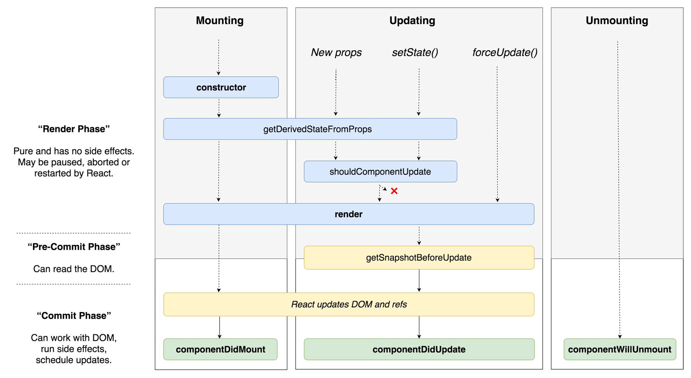
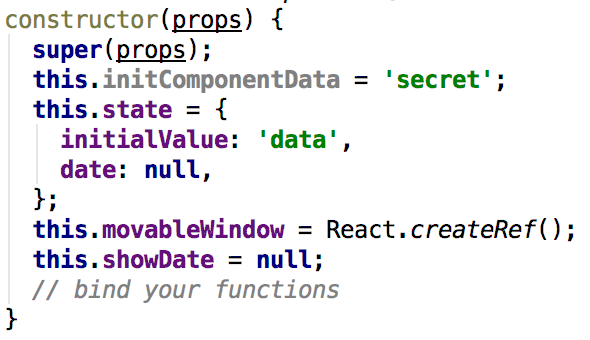

### Исследуем React lifecycle
### Содержание
1. [Жизненный цикл](#Жизненный-цикл)
1. [Создание и иницилизация компонента](#Создание-и-иницилизация-компонента)
    1. [constructor](#constructor)
    1. [getDerivedStateFromProps](#getderivedstatefromprops)
    1. [componentDidMount](#componentdidmount)
1. [Обновление компонента](#Обновление-компонента)
1. [deprecated](#deprecated)

## Жизненный цикл

___
## Создание и иницилизация компонента
1. constructor
1. getDerivedStateFromProps
1. componentDidMount

#### constructor

**Можно**
* Установите изначальное состояние компонента
* Задайте значений state
* “Привяжите” this к вашим функциям, если не используете стрелочные функции для методов

**Нельзя**
* Не выполняйте никаких сайд-эффектов

**Избегайте**
* Копирования свойств props в state, они будут доступны и так. Исключением можно считать случай, когда мы хотим игнорировать обновления props

#### getDerivedStateFromProps
#### componentDidMount

## Обновление компонента

## deprecated

* componentWillMount
* componentWillReceiveProps(nextProps)
* componentWillUpdate(nextProps, nextState)

