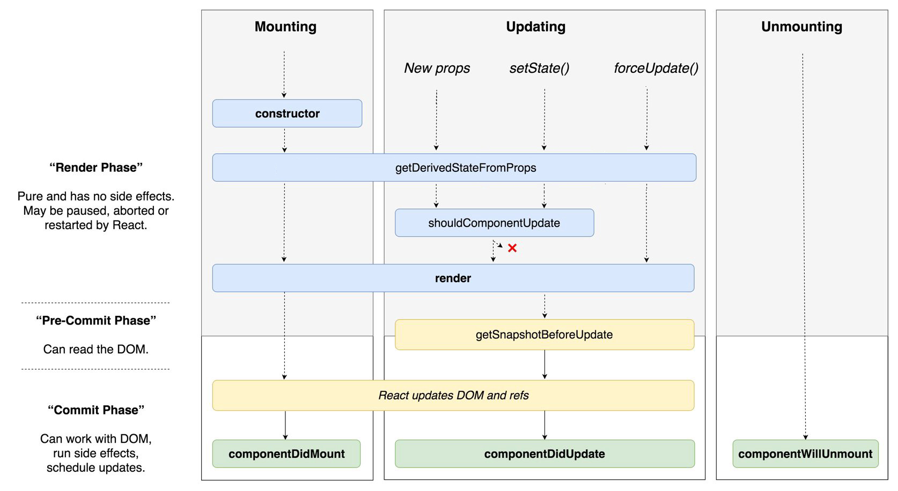

### Исследуем React lifecycle
### Содержание
1. [Жизненный цикл](#lifecycle)
1. [Создание и иницилизация компонента](#mounting)

## Жизненный цикл

___
## Создание и иницилизация компонента
1. constructor
1. getDerivedStateFromProps
1. componentDidMount
